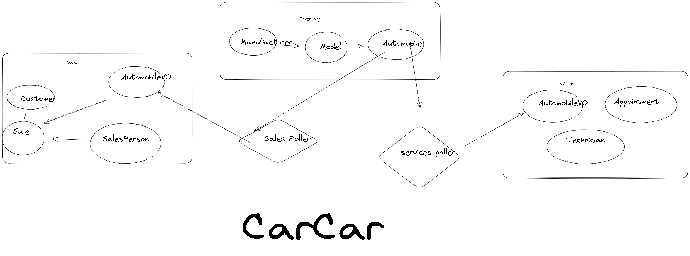

# CarCar


CarCar, an application for managing aspects of an automobile dealership—specifically its inventory, service center, and sales.

### Team:

* Daniel Hernandez - Sales
* Kevin C. - Services
## Design




## API Reference

 Inventory

```http
Automobiles
```

| Action         | Request  | Endpoint               |
| :-----------     | :------- | :--------------------- |
| List Automobiles |  `GET`   |  `8100/api/automobiles/`   |
| Create Automobile |  `POST`   |  `8100/api/automobiles`   |
| Get Automobile    | `PUT`   | `8100/api/automobiles/vin/`|
| Update Automobile |  `PUT`   |  `8100/api/automobiles/vin/` |
| Delete Automobile |  `DELETE` |  `8100/api/automobiles/vin/` |


```http
Manufacturers
```


| Action         | Request  | Endpoint               |
| :-----------     | :------- | :--------------------- |
| List Manufacturers |  `GET`   |  `8100/api/manufacturers/`   |
| Create Manufacturer |  `POST`   |  `8100/api/manufacturers`   |
| Get Manufacturer |  `GET`   |  `8100/api/manufacturers/id/` |
| Update Manufacturer |  `PUT` | `8100/api/manufacturers/id/` |
| Delete Manufacturer |  `DELETE`   |  `8100/api/manufacturers/id/` |


```http
VehicleModels
```


| Action         | Request  | Endpoint               |
| :-----------  | :------- | :--------------------- |
| List VehicleModels    |  `GET`   |  `8100/api/models/`   |
| Create VehicleModel |  `POST`   |  `8100/api/models`   |
| GET VehicleModel |  `GET`   |  `8100/api/models/id/` |
| Update VehicleModel |  `PUT`   |  `8100/api/models/id/` |
| Delete VehicleModel |  `DELETE`   |  `8100/api/models/id/` |


Automobile Services

```http
Technicians
```

| Action         | Request  | Endpoint               |
| :-----------     | :------- | :--------------------- |
| List Technicians |  `GET`   |  `/api/technicians/`   |
| Create Technician |  `POST`   |  `/api/technicians/`   |
| Delete Technician | `DELETE` | `/api/technicians/id/`|


```http
Appointments
```


| Action         | Request  | Endpoint               |
| :-----------     | :------- | :--------------------- |
| List Appointments |  `GET`   |  `/api/appointments/`   |
| Create Appointments |  `POST`   |  `/api/appointments`   |
| Get Appointments |  `GET`   |  `/api/appointments/id/` |
|Set Appointment status to canceled|`PUT`|`/api/appointments/id/cancel`|
|Set Appointment status to finished|`PUT`|`/api/appointments/id/finish`|


Automobile Sales

```http
Salespeople
```

| Action       | Request  |Endpoint  |
| :--------   | :------- | :-------------------------------- |
| List salespeople | `GET` | `8090/api/salespeople/` |
| Create salespoeple| `POST` |`809api/salespeople/` |
| Delete salespeople| `DELETE` | `8090/api/salespeople/id/` |


```http
return Response:
"Firsname", "LastName", "Employee ID"```


```http
Customers
```

| Action         | Request  | Endpoint               |
| :-----------     | :------- | :--------------------- |
| List customers |  `GET`   |  `8090/api/automobiles/`   |
| Create customer |  `POST`   |  `8090/api/automobiles`   |
| Delete customer |  `DELETE`   |  `8090/api/automobiles/id/` |


```http
Return Response:
"First Namne", "Last Name", "Phone Number", "Address"```

```http
sales
```

| Action         | Request  | Endpoint               |
| :-----------     | :------- | :--------------------- |
| List sales |  `GET`   |  `8090/api/sales/`   |
| Record new sale |  `POST`   |  `8090/api/sales/`   |
| Delete sale |  `DELETE`   |  `8090/api/sales/id/` |


