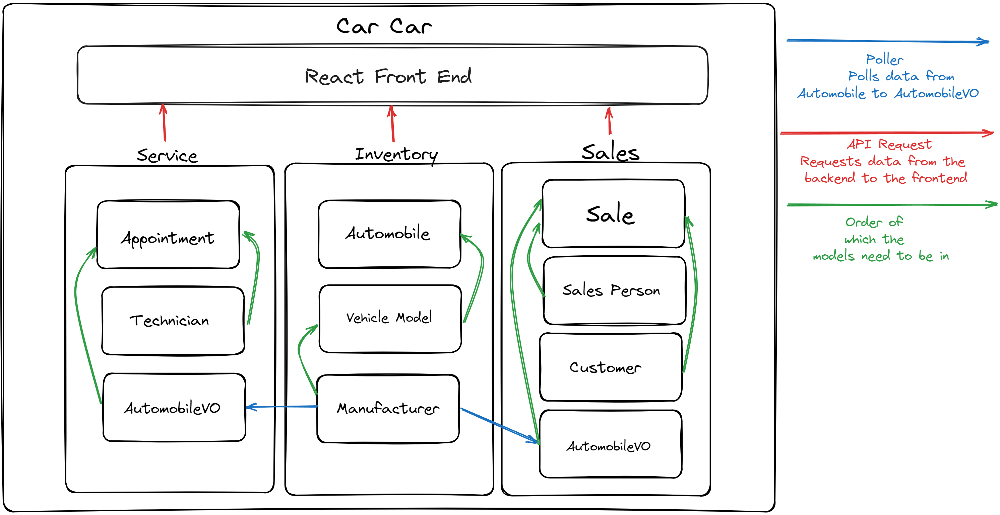
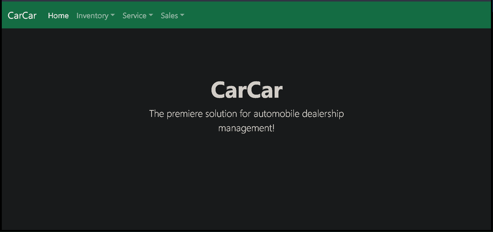
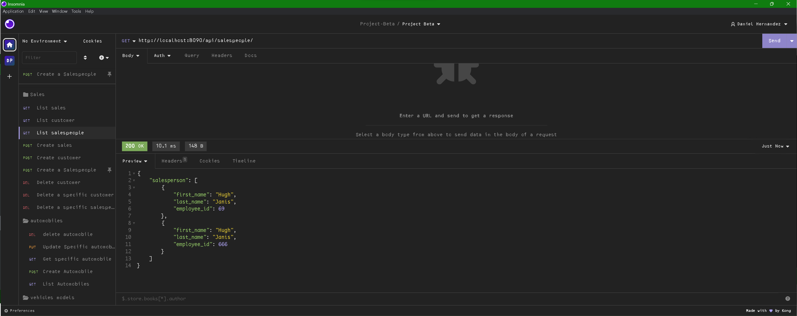
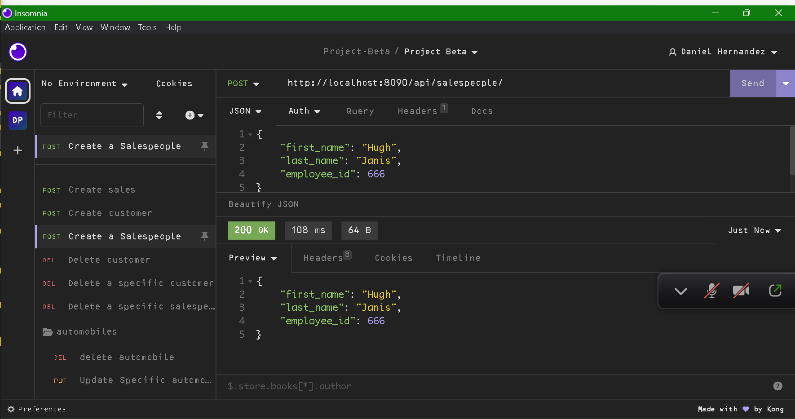
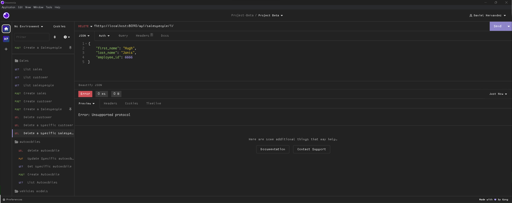
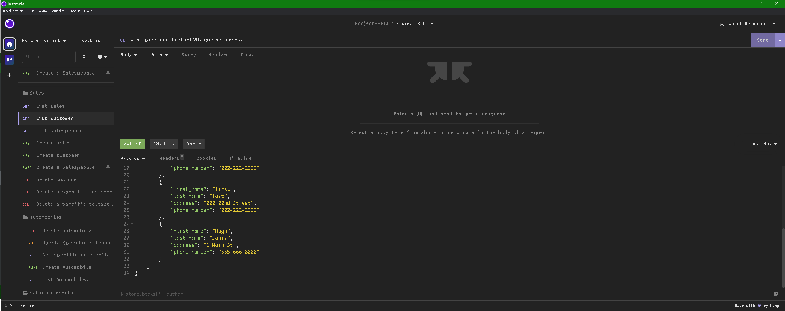
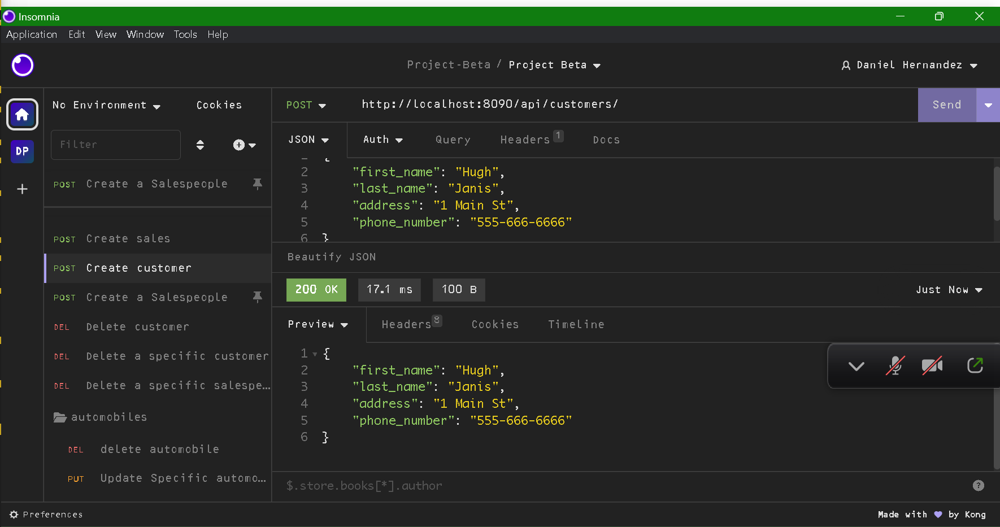
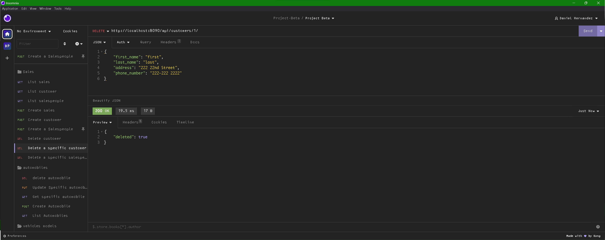
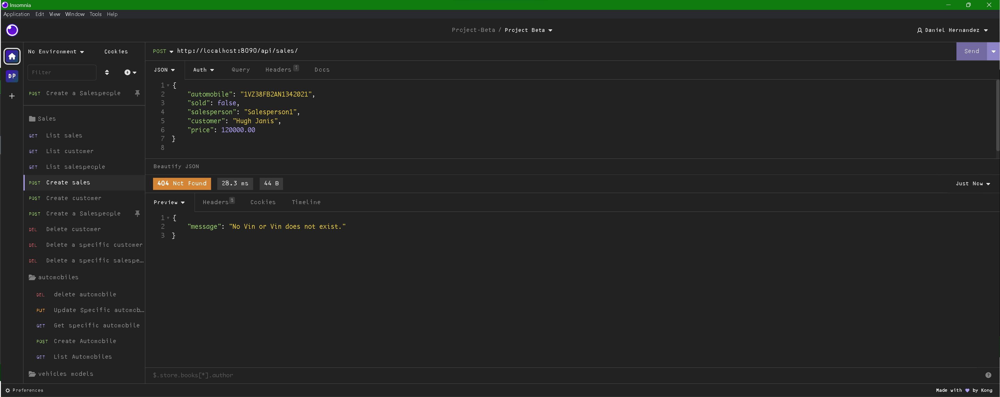

# CarCar

CarCar, an application for managing aspects of an automobile dealership—specifically its inventory, service center, and sales.

### Team:

##### * [Daniel Hernandez](https://gitlab.com/Rorschach3)- Sales microservice

##### * [Jorge Laderos De Santiago](https://gitlab.com/landerosjorge) - Service microservice

## Install and Run Locally

**Make sure you have Docker, Git, and Node.js 18.2 or above**

Fork the repository using this link
`https://gitlab.com/landerosjorge/project-beta`


Then clone the project

```bash
  git clone https://gitlab.com/landerosjorge/project-beta.git
```

Go to the project directory

```bash
  cd project-beta
```

Install database

```bash
  docker volume create beta-data
```

Build the Docker containers
Wait until the process is completely finished before running the next command.

```bash
 docker-compose build
```
Start up Docker containers

```bash
 docker-compose up
```


## Design


## Homepage



#

# Inventory Microservice

Lorem ipsum dolor sit amet, consectetur adipiscing elit, sed do eiusmod tempor incididunt ut labore et dolore magna aliqua. Ut enim ad minim veniam, quis nostrud exercitation ullamco laboris nisi ut aliquip ex ea commodo consequat. Duis aute irure dolor in reprehenderit in voluptate velit esse cillum dolore eu fugiat nulla pariatur. Excepteur sint occaecat cupidatat non proident, sunt in culpa qui officia deserunt mollit anim id est laborum.

## API References For Inventory

```http
Automobiles
```

| Action         | Request  | Endpoint               |
| :-----------     | :------- | :--------------------- |
| List Automobiles |  `GET`   |  `http://localhost:8100/api/automobiles/`   |
| Create Automobile |  `POST`   |  `http://localhost:8100/api/automobiles/`   |
| Get Specific Automobile     | `GET`   | `http://localhost:8100/api/automobiles/:vin/`|
| Update Specific Automobile |  `PUT`   |  `http://localhost:8100/api/automobiles/:vin/` |
| Delete Specific Automobile |  `DELETE` |  `http://localhost:8100/api/automobiles/:vin/` |

```http
Manufacturers
```

| Action         | Request  | Endpoint               |
| :-----------     | :------- | :--------------------- |
| List Manufacturers |  `GET`   |  `http://localhost:8100/api/manufacturers/`   |
| Create Manufacturer |  `POST`   |  `http://localhost:8100/api/manufacturers/`   |
| Get Specific Manufacturer |  `GET`   |  `http://localhost:8100/api/manufacturers/:id/` |
| Update Specific Manufacturer |  `PUT` | `http://localhost:8100/api/manufacturers/:id/` |
| Delete Specific Manufacturer |  `DELETE`   |  `http://localhost:8100/api/manufacturers/:id/` |

```http
VehicleModels
```

| Action         | Request  | Endpoint               |
| :-----------  | :------- | :--------------------- |
| List Vehicle Models    |  `GET`   |  `http://localhost:8100/api/models/`   |
| Create Vehicle Model |  `POST`   |  `http://localhost:8100/api/models/`   |
| GET Specific Vehicle Model |  `GET`   |  `http://localhost:8100/api/models/:id/` |
| Update Specific Vehicle Model |  `PUT`   |  `http://localhost:8100/api/models/:id/` |
| Delete Specific Vehicle Model |  `DELETE`   |  `http://localhost:8100/api/models/:id/` |

#

# Sales Microservice

The Sales functionality needs to keep track of automobile sales that come from the inventory. A person cannot sell a car that is not listed in the inventory, nor can a person sell a car that has already been sold.

## API References For Sales

```http
Salespeople
```

| Action       | Request  |Endpoint  |
| :--------   | :------- | :-------------------------------- |
| List salespeople | `GET` | `8090/api/salespeople/` |
| Create salespoeple| `POST` |`809api/salespeople/` |
| Delete salespeople| `DELETE` | `8090/api/salespeople/id/` |





```http
return Response:
"Firsname", "LastName", "Employee ID"
```

```http
Customers
```

| Action         | Request  | Endpoint               |
| :-----------     | :------- | :--------------------- |
| List customers |  `GET`   |  `8090/api/automobiles/`   |
| Create customer |  `POST`   |  `8090/api/automobiles`   |
| Delete customer |  `DELETE`   |  `8090/api/automobiles/id/` |





```http
Return Response:
"First Namne", "Last Name", "Phone Number", "Address"
```

```http
sales
```

| Action         | Request  | Endpoint               |
| :-----------     | :------- | :--------------------- |
| List sales |  `GET`   |  `8090/api/sales/`   |
| Record new sale |  `POST`   |  `8090/api/sales/`   |
| Delete sale |  `DELETE`   |  `8090/api/sales/id/` |




```http
Return Response:
Automobile VIN, Salersperson, Customer, Price
```
#

# Service Microservice

Lorem ipsum dolor sit amet, consectetur adipiscing elit, sed do eiusmod tempor incididunt ut labore et dolore magna aliqua. Ut enim ad minim veniam, quis nostrud exercitation ullamco laboris nisi ut aliquip ex ea commodo consequat. Duis aute irure dolor in reprehenderit in voluptate velit esse cillum dolore eu fugiat nulla pariatur. Excepteur sint occaecat cupidatat non proident, sunt in culpa qui officia deserunt mollit anim id est laborum.

 ## API References For Service

```http
Technicians
```

| Action         | Request  | Endpoint               |
| :-----------     | :------- | :--------------------- |
| List Technicians |  `GET`   |  `/api/technicians/`   |
| Create Technician |  `POST`   |  `/api/technicians/`   |
| Delete Technician | `DELETE` | `/api/technicians/id/`|

```http
Appointments
```

| Action         | Request  | Endpoint               |
| :-----------     | :------- | :--------------------- |
| List Appointments |  `GET`   |  `/api/appointments/`   |
| Create Appointments |  `POST`   |  `/api/appointments`   |
| Get Appointments |  `GET`   |  `/api/appointments/id/` |
|Set Appointment status to canceled|`PUT`|`/api/appointments/id/cancel`|
|Set Appointment status to finished|`PUT`|`/api/appointments/id/finish`|
