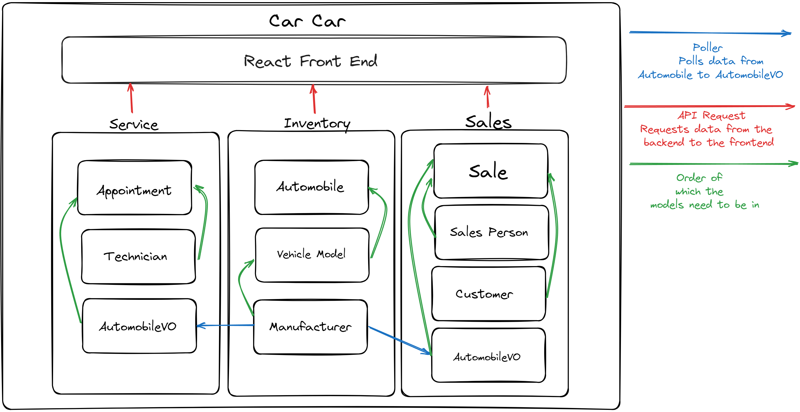

# CarCar – Dealership Management Platform

CarCar is a web application for managing an automobile dealership’s Inventory, Sales, and Service processes. It uses a microservices architecture (each service in Django) and a React frontend.

---

## Team

* [Daniel Hernandez](https://gitlab.com/Rorschach3)
* [Jorge Landeros De Santiago](https://gitlab.com/landerosjorge)

---

## Demo & Screenshots

**Homepage**


**Design Diagram**


---

## Installation & Local Run

**Prerequisites:** Docker & Docker Compose, Node.js v18+, Git

1. **Clone & enter repo**

   ```bash
   git clone https://gitlab.com/landerosjorge/project-beta.git
   cd project-beta
   ```

2. **Create database volume**

   ```bash
   docker volume create beta-data
   ```

3. **Build containers**

   ```bash
   docker-compose build
   ```

4. **Start services**

   ```bash
   docker-compose up
   ```

5. **Open in browser**
   Visit [http://localhost:3000](http://localhost:3000)

---

## Initial Data Setup

On first run, the databases are empty. Create records in this order:

1. Manufacturer
2. Vehicle Model
3. Automobile
4. Sales Person
5. Customer
6. Sale
7. Technician
8. Service Appointment

---

## Microservices Overview

| Service   | Port | Purpose                              |
| --------- | ---- | ------------------------------------ |
| Inventory | 8100 | Manage manufacturers, models, autos  |
| Sales     | 8090 | Manage salespeople, customers, sales |
| Service   | 8080 | Manage technicians & appointments    |

All services share an AutomobileVO value object to mirror Inventory data.

---

## API Reference

### Inventory API (localhost:8100)

#### Manufacturers

| Action   | Method | Endpoint                   |
| -------- | ------ | -------------------------- |
| List     | GET    | `/api/manufacturers/`      |
| Create   | POST   | `/api/manufacturers/`      |
| Retrieve | GET    | `/api/manufacturers/{id}/` |
| Update   | PUT    | `/api/manufacturers/{id}/` |
| Delete   | DELETE | `/api/manufacturers/{id}/` |

**Create Example**
Request body:

```json
{ "name": "Honda" }
```

Response (list):

```json
{
  "manufacturers": [
    { "href": "/api/manufacturers/1/", "id": 1, "name": "Honda" }
  ]
}
```

#### Vehicle Models

| Action   | Method | Endpoint            |
| -------- | ------ | ------------------- |
| List     | GET    | `/api/models/`      |
| Create   | POST   | `/api/models/`      |
| Retrieve | GET    | `/api/models/{id}/` |
| Update   | PUT    | `/api/models/{id}/` |
| Delete   | DELETE | `/api/models/{id}/` |

**Create Example**

```json
{
  "name": "S2000",
  "picture_url": "https://upload.wikimedia.org/.../S2000.jpg",
  "manufacturer_id": 1
}
```

#### Automobiles

| Action   | Method | Endpoint                  |
| -------- | ------ | ------------------------- |
| List     | GET    | `/api/automobiles/`       |
| Create   | POST   | `/api/automobiles/`       |
| Retrieve | GET    | `/api/automobiles/{vin}/` |
| Update   | PUT    | `/api/automobiles/{vin}/` |
| Delete   | DELETE | `/api/automobiles/{vin}/` |

**Create Example**

```json
{
  "color": "White",
  "year": 2000,
  "vin": "JHMAP11432T2N3BH3",
  "model_id": 1
}
```

---

### Sales API (localhost:8090)

#### Salespeople

| Action | Method | Endpoint                 |
| ------ | ------ | ------------------------ |
| List   | GET    | `/api/salespeople/`      |
| Create | POST   | `/api/salespeople/`      |
| Delete | DELETE | `/api/salespeople/{id}/` |

**Create Example**

```json
{
  "first_name": "Jane",
  "last_name": "Doe",
  "employee_id": 42
}
```

#### Customers

| Action | Method | Endpoint               |
| ------ | ------ | ---------------------- |
| List   | GET    | `/api/customers/`      |
| Create | POST   | `/api/customers/`      |
| Delete | DELETE | `/api/customers/{id}/` |

**Create Example**

```json
{
  "first_name": "John",
  "last_name": "Smith",
  "address": "123 Main St",
  "phone_number": "555-1234"
}
```

#### Sales Records

| Action | Method | Endpoint           |
| ------ | ------ | ------------------ |
| List   | GET    | `/api/sales/`      |
| Create | POST   | `/api/sales/`      |
| Delete | DELETE | `/api/sales/{id}/` |

**Create Example**

```json
{
  "price": 25000,
  "automobile": "JHMAP11432T2N3BH3",
  "salesperson": 1,
  "customer": 1
}
```

---

### Service API (localhost:8080)

#### Technicians

| Action | Method | Endpoint                 |
| ------ | ------ | ------------------------ |
| List   | GET    | `/api/technicians/`      |
| Create | POST   | `/api/technicians/`      |
| Delete | DELETE | `/api/technicians/{id}/` |

**Create Example**

```json
{
  "first_name": "Jorge",
  "last_name": "Landeros",
  "employee_id": 7
}
```

#### Appointments

| Action | Method | Endpoint                         |
| ------ | ------ | -------------------------------- |
| List   | GET    | `/api/appointments/`             |
| Create | POST   | `/api/appointments/`             |
| Cancel | PUT    | `/api/appointments/{id}/cancel/` |
| Finish | PUT    | `/api/appointments/{id}/finish/` |

**Create Example**

```json
{
  "date_time": "2025-05-10T14:30:00",
  "reason": "Oil change",
  "vin": "JHMAP11432T2N3BH3",
  "customer": "John Smith",
  "technician": 7
}
```

---

## Frontend Routes

| Section   | URL                            | React Component         |
| --------- | ------------------------------ | ----------------------- |
| Inventory | `/inventory/manufacturers`     | `ManufacturerList`      |
|           | `/inventory/manufacturers/new` | `ManufacturerForm`      |
|           | `/inventory/models`            | `ModelsList`            |
|           | `/inventory/models/new`        | `ModelForm`             |
|           | `/inventory/automobiles`       | `AutosList`             |
|           | `/inventory/automobiles/new`   | `AutoForm`              |
| Sales     | `/sales/salespeople`           | `Salespeople`           |
|           | `/sales/salesperson/new`       | `SalespersonCreateForm` |
|           | `/sales/customers`             | `CustomerList`          |
|           | `/sales/customer/new`          | `CustomerForm`          |
|           | `/sales/sales`                 | `SalesList`             |
|           | `/sales/sales/new`             | `SalesForm`             |
| Service   | `/service/technician`          | `TechnicianList`        |
|           | `/service/technician/new`      | `TechnicianForm`        |
|           | `/service/appointment`         | `AppointmentList`       |
|           | `/service/appointment/new`     | `AppointmentForm`       |
|           | `/service/history`             | `ServiceHistory`        |

---


### Demo Video
[Watch Demo](https://github.com/Rorschach3/Project-Beta/assets/42761673/6b6eb9e6-c9d0-4799-a233-65bb644decbc)

For more details or troubleshooting, refer to the project’s source code and documentation. Enjoy using CarCar!
