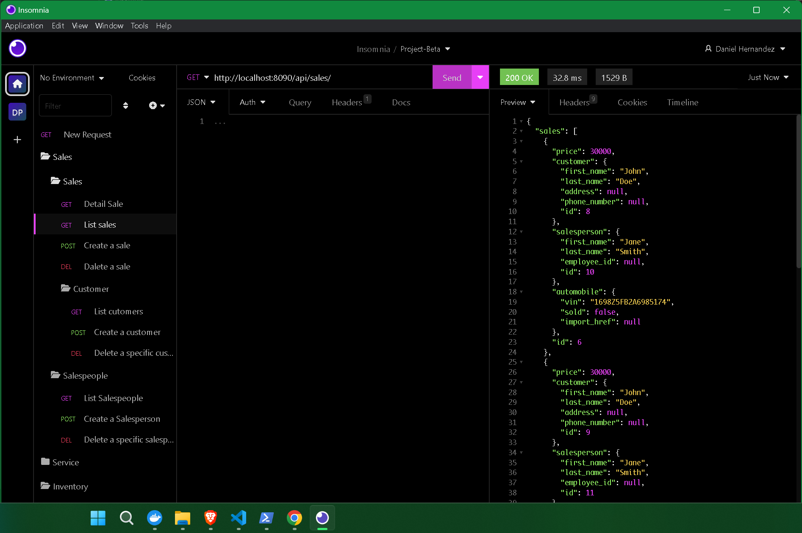

# CarCar

CarCar, an application for managing aspects of an automobile dealership—specifically its inventory, service center, and sales.

### Team:

##### * [Daniel Hernandez](https://gitlab.com/Rorschach3)- Sales microservice

##### * [Jorge Laderos De Santiago](https://gitlab.com/landerosjorge) - Service microservice

## Install and Run Locally

**Make sure you have Docker, Git, and Node.js 18.2 or above**

Fork the repository using this link
`https://gitlab.com/landerosjorge/project-beta`

Then clone the project

```bash
  git clone https://gitlab.com/landerosjorge/project-beta.git

```

3. Change directories into to the project directory

```bash
  cd project-beta

```

4. Create database using Docker command

```bash
  docker volume create beta-data

```

5. Build the Docker containers.
   Wait until this process is completely finished before running the next command.

```bash
 docker-compose build

```

6. Start up Docker containers

```bash
 docker-compose up

```

7. Open project using your favorite code editor VS Code

```bash
code .

```

## Design


## Homepage


# 

# Inventory Microservice

**Overview**
The Inventory microservice focuses on creating and maintaining data related to the available automobiles. It serves as a centralized system for tracking the inventory and plays a crucial role in supporting both the Sales and Services microservices.

**Functionality**
The Inventory microservice offers the following key functionalities:
Inventory Management: It handles the creation, updating, and retrieval of automobile data within the inventory. This includes storing information such as the manufacturer, model, and other relevant details.
Integration with Sales Microservice: The Inventory microservice collaborates closely with the Sales microservice. It ensures that only cars listed in the inventory can be sold, preventing unauthorized sales of unavailable or sold-out automobiles.
Integration with Service Microservice: The Inventory microservice also interacts with the Service microservice. It provides the necessary automobile data to support service-related operations and ensures accurate tracking of the current inventory.

**AutomobileVO** Creation: When data is sent from the Inventory microservice to other microservices, such as Sales or Services, a reference known as the AutomobileVO is used. The AutomobileVO contains essential information about the automobiles, including the Vehicle Identification Number (VIN), sold status, and import source. This reference allows efficient communication and synchronization between microservices.

**Dependencies**
The Inventory microservice relies on the following dependencies:
Sales Microservice: The Inventory microservice collaborates with the Sales microservice to enforce inventory-related business rules and facilitate the sales process. It ensures that only valid and available cars can be sold.
Service Microservice: The Inventory microservice integrates with the Service microservice to support service-related operations. It provides the necessary automobile data to enable efficient servicing and maintenance of vehicles.

## API References For Inventory

---

***Manufacturers***

| Action         | Request  | Endpoint               |
| :-----------     | :------- | :--------------------- |
| List Manufacturers |  `GET`   |  `http://localhost:8100/api/manufacturers/`   |
| Create Manufacturer |  `POST`   |  `http://localhost:8100/api/manufacturers/`   |
| Get Specific Manufacturer |  `GET`   |  `http://localhost:8100/api/manufacturers/:id/` |
| Update Specific Manufacturer |  `PUT` | `http://localhost:8100/api/manufacturers/:id/` |
| Delete Specific Manufacturer |  `DELETE`   |  `http://localhost:8100/api/manufacturers/:id/` |

**Body Required to Create A Manufacturer**

```json
{
  "name": "Honda"
}

```

**Return Response: Creating A Manufacturer**

```json
{
  "href": "/api/manufacturers/1/",
  "id": 1,
  "name": "Honda"
}

```

**Return Response: List Manufacturers**

```json
{
	"manufacturers": [
		{
			"href": "/api/manufacturers/1/",
			"id": 1,
			"name": "Honda"
		},
		{
			"href": "/api/manufacturers/2/",
			"id": 2,
			"name": "Nissan"
		},
		{
			"href": "/api/manufacturers/3/",
			"id": 3,
			"name": "Toyota"
		}
	]
}

```

---

***Vehicle Models***

| Action         | Request  | Endpoint               |
| :-----------  | :------- | :--------------------- |
| List Vehicle Models    |  `GET`   |  `http://localhost:8100/api/models/`   |
| Create Vehicle Model |  `POST`   |  `http://localhost:8100/api/models/`   |
| GET Specific Vehicle Model |  `GET`   |  `http://localhost:8100/api/models/:id/` |
| Update Specific Vehicle Model |  `PUT`   |  `http://localhost:8100/api/models/:id/` |
| Delete Specific Vehicle Model |  `DELETE`   |  `http://localhost:8100/api/models/:id/` |

**Body Required to Create A Vehicle Model**

```json
{
  "name": "S200",
  "picture_url": "https://upload.wikimedia.org/wikipedia/commons/thumb/d/dc/HondaS2000-004.jpg/1200px-HondaS2000-004.jpg",
  "manufacturer_id": 1
}

```

**Return Response: Creating A Vehicle Model**

```json
{
	"href": "/api/models/1/",
	"id": 1,
	"name": "S200",
	"picture_url": "https://upload.wikimedia.org/wikipedia/commons/thumb/d/dc/HondaS2000-004.jpg/1200px-HondaS2000-004.jpg",
	"manufacturer": {
		"href": "/api/manufacturers/1/",
		"id": 1,
		"name": "Honda"
	}
}

```

**Return Response: List Vehicle Models**

```json
{
	"models": [
		{
			"href": "/api/models/1/",
			"id": 1,
			"name": "S200",
			"picture_url": "https://upload.wikimedia.org/wikipedia/commons/thumb/d/dc/HondaS2000-004.jpg/1200px-HondaS2000-004.jpg",
			"manufacturer": {
				"href": "/api/manufacturers/1/",
				"id": 1,
				"name": "Honda"
			}
		},
		{
			"href": "/api/models/2/",
			"id": 2,
			"name": "R34",
			"picture_url": "https://cars.usnews.com/images/article/202203/129043/001-_Tokumeigakarinoaoshima_-_wc_-_Tuned_Nissan_SKYLINE_GT-R_GF-BNR34_front_Cropped.jpg",
			"manufacturer": {
				"href": "/api/manufacturers/2/",
				"id": 2,
				"name": "Nissan"
			}
		},
		{
			"href": "/api/models/3/",
			"id": 3,
			"name": "Supra",
			"picture_url": "https://cdn.motor1.com/images/mgl/PKZQL/s1/1997-toyota-supra-sold-for-176-000-at-auction.jpg",
			"manufacturer": {
				"href": "/api/manufacturers/3/",
				"id": 3,
				"name": "Toyota"
			}
		}
	]
}

```

---

***Automobiles***

| Action         | Request  | Endpoint               |
| :-----------     | :------- | :--------------------- |
| List Automobiles |  `GET`   |  `http://localhost:8100/api/automobiles/`   |
| Create Automobile |  `POST`   |  `http://localhost:8100/api/automobiles/`   |
| Get Specific Automobile     | `GET`   | `http://localhost:8100/api/automobiles/:vin/`|
| Update Specific Automobile |  `PUT`   |  `http://localhost:8100/api/automobiles/:vin/` |
| Delete Specific Automobile |  `DELETE` |  `http://localhost:8100/api/automobiles/:vin/` |

**Body Required to Create A Automobile**

```json
{
  "color": "White",
  "year": 2000,
  "vin": "JHMAP11432T2N3BH3",
  "model_id": 1
}

```

**Return Response: Creating A Automobile**

```json
{
	"href": "/api/automobiles/JHMAP11432T2N3BH3/",
	"id": 1,
	"color": "White",
	"year": 2000,
	"vin": "JHMAP11432T2N3BH3",
	"model": {
		"href": "/api/models/1/",
		"id": 1,
		"name": "S200",
		"picture_url": "https://upload.wikimedia.org/wikipedia/commons/thumb/d/dc/HondaS2000-004.jpg/1200px-HondaS2000-004.jpg",
		"manufacturer": {
			"href": "/api/manufacturers/1/",
			"id": 1,
			"name": "Honda"
		}
	},
	"sold": false
}

```

**Return Response: List Automobiles**

```json
{
	"autos": [
		{
			"href": "/api/automobiles/JHMAP11432T2N3BH3/",
			"id": 1,
			"color": "White",
			"year": 2000,
			"vin": "JHMAP11432T2N3BH3",
			"model": {
				"href": "/api/models/1/",
				"id": 1,
				"name": "S200",
				"picture_url": "https://upload.wikimedia.org/wikipedia/commons/thumb/d/dc/HondaS2000-004.jpg/1200px-HondaS2000-004.jpg",
				"manufacturer": {
					"href": "/api/manufacturers/1/",
					"id": 1,
					"name": "Honda"
				}
			},
			"sold": false
		},
		{
			"href": "/api/automobiles/FDJ9011432T2N3BH3/",
			"id": 2,
			"color": "White",
			"year": 1998,
			"vin": "FDJ9011432T2N3BH3",
			"model": {
				"href": "/api/models/2/",
				"id": 2,
				"name": "R34",
				"picture_url": "https://cars.usnews.com/images/article/202203/129043/001-_Tokumeigakarinoaoshima_-_wc_-_Tuned_Nissan_SKYLINE_GT-R_GF-BNR34_front_Cropped.jpg",
				"manufacturer": {
					"href": "/api/manufacturers/2/",
					"id": 2,
					"name": "Nissan"
				}
			},
			"sold": false
		},
		{
			"href": "/api/automobiles/FDJ9085032T2N3BH3/",
			"id": 3,
			"color": "Black",
			"year": 1997,
			"vin": "FDJ9085032T2N3BH3",
			"model": {
				"href": "/api/models/3/",
				"id": 3,
				"name": "Supra",
				"picture_url": "https://cdn.motor1.com/images/mgl/PKZQL/s1/1997-toyota-supra-sold-for-176-000-at-auction.jpg",
				"manufacturer": {
					"href": "/api/manufacturers/3/",
					"id": 3,
					"name": "Toyota"
				}
			},
			"sold": false
		}
	]
}

```

---

# Sales Microservice

### Automobile Services

**Overview**
The Sales microservice handles the entire sales lifecycle, from tracking available automobiles to processing sales transactions. It plays a key role in maintaining accurate sales records and enforcing business rules related to car sales.

**Dependencies**
The Sales microservice relies on other microservices and entities to function effectively:
Inventory Microservice: The Sales microservice depends on the Inventory microservice to access and verify the availability of automobiles for sale. It ensures that only valid and available cars can be sold.

**Automobile Value Object** (AutomobileVO): The Sales microservice utilizes the AutomobileVO, which contains essential information about the automobiles. This includes the Vehicle Identification Number (VIN), sold status, and import source. The AutomobileVO is also updated automatically through the poller.py file, ensuring accurate and up-to-date information.
Salesperson and Customer Services: The Sales microservice interacts with the Salesperson and Customer services to associate sales transactions with the respective salespersons and customers. The Salesperson service stores information such as First Name, Last Name, and Employee ID, while the Customer service stores details like First Name, Last Name, Address, and Phone Number.

**Functionality**
The Sales microservice offers the following key functionalities:
Sales Transaction Management: It manages the sales transactions, including creating new sales, updating existing sales records, and retrieving sales information.
Business Rule Enforcement: The Sales microservice enforces specific business rules to maintain data integrity. For example, it ensures that a car cannot be sold if it is not listed in the inventory or has already been sold.
AutomobileVO Updates: When a new sale is created, the Sales microservice automatically updates the corresponding AutomobileVO's VIN to reflect the sold status. This integration ensures accurate tracking of automobile sales within the Inventory microservice.

```http
Salespeople
```

| Action       | Request  |Endpoint  |
| :--------   | :------- | :-------------------------------- |
| List salespeople | `GET` | `http://localhost:8090/api/salespeople/` |
| Create salespoeple| `POST` |`http://localhost:8090/api/salespeople/` |
| Delete salespeople| `DELETE` | `http://localhost:8090/api/salespeople/1/` |


```http
return Response:
"Firsname", "LastName", "Employee ID"
```

```http
Customers
```

| Action         | Request  | Endpoint               |
| :-----------     | :------- | :--------------------- |
| List customers |  `GET`   |  `http://localhost:8090/api/customers/`   |
| Create customer |  `POST`   |  `http://localhost:8090/api/customers/`  |
| Delete customer |  `DELETE`   |  `http://localhost:8090/api/customers/1/`   |


```http
Return Response:
"First Namne", "Last Name", "Phone Number", "Address"
```

```http
sales
```

| Action         | Request  | Endpoint               |
| :-----------     | :------- | :--------------------- |
| List sales |  `GET`   |  `http://localhost:8090/api/sales/`   |
| Record new sale |  `POST`   |  `http://localhost:8090/api/sales/`    |
| Delete sale |  `DELETE`   |  `http://localhost:8090/api/sales/1/`  |




```http
Return Response:
Automobile VIN, Salesperson, Customer, Price
```

# 

# Service Microservice

Kepps track of all service related things to the automobiles, it keeps track of current technicians inside our dealership and also all the service appointments wheter it being past or current. For each technician is assigned a employee id and id to keep track of which tecnician did what service. For each service we keep a record of when it was done, which technician was assigned, the reason, the current status, the vehicle vin, the customer name and their vip status. In order to keep track of VIP statuses we compare the vin inside our Appointment model with the AutomobileVO and if they match, meaning that vin is inside our dealerships inventory making them a VIP. The technician also has the option to finish and cancel an appointment for special occasions.

## API References For Service

---

***Technicians***

| Action         | Request  | Endpoint               |
| :-----------     | :------- | :--------------------- |
| List technicians |  `GET`   |  `http://localhost:8080/api/technicians/`   |
| Create a technician |  `POST`   |  `http://localhost:8080/api/technicians/`   |
| Delete a specific technician |  `DELETE`   |  `http://localhost:8080/api/technicians/:id/`   |

**Body Required to Create A Technician**

```json
{
	"first_name": "Jorge",
	"last_name": "Landeros",
	"employee_id": "1"
}

```

**Return Response: Creating A Technician**

```json
{
	"first_name": "Jorge",
	"last_name": "Landeros",
	"employee_id": "1",
	"id": 1
}

```

**Return Response: List Technicians**

```json
{
	"technicians": [
		{
			"first_name": "Jorge",
			"last_name": "Landeros",
			"employee_id": "1",
			"id": 1
		},
		{
			"first_name": "John",
			"last_name": "Doe",
			"employee_id": "2",
			"id": 2
		},
		{
			"first_name": "Jane",
			"last_name": "Doe",
			"employee_id": "3",
			"id": 3
		}
	]
}

```

**Return Response: Deleting A Technician (id:1)**

```sh
{
	"deleted": true
}

```

---

***Appointments***

| Action         | Request  | Endpoint               |
| :-----------     | :------- | :--------------------- |
| List Appointments |  `GET`   |  `http://localhost:8080/api/appointments/`   |
| Create an Appointment |  `POST`   |  `http://localhost:8080/api/appointments/`   |
| Delete an Appointment |  `DELETE`   |  `http://localhost:8080/api/appointments/:id/`   |
| Finish Appointment |  `PUT`   |  `http://localhost:8080/api/appointments/:id/finish/`   |
| Cancel Appointment |  `PUT`   |  `http://localhost:8080/api/appointments/:id/cancel/`   |

**Body Required to Create an Appointment**

```json
{
	"date_time": "2026-06-06T23:29:43+00:00",
	"reason": "Windshield",
	"vin": "JHMAP11432T2N3BH3",
	"customer": "John Doe",
	"technician": "1"
}

```

**Return Response: Creating an Appointment**

```json
{
	"id": 1,
	"is_vip": true,
	"date_time": "2026-06-06T23:29:43+00:00",
	"reason": "Windshield",
	"status": "current",
	"vin": "JHMAP11432T2N3BH3",
	"customer": "John Doe",
	"technician": {
		"first_name": "Jorge",
		"last_name": "Landeros",
		"employee_id": "1",
		"id": 1
	}
}

```

**Return Response: List Appointments**

```json
{
	"appointments": [
		{
			"id": 1,
			"is_vip": true,
			"date_time": "2026-06-06T23:29:43+00:00",
			"reason": "Windshield",
			"status": "current",
			"vin": "JHMAP11432T2N3BH3",
			"customer": "John Doe",
			"technician": {
				"first_name": "Jorge",
				"last_name": "Landeros",
				"employee_id": "1",
				"id": 1
			}
		},
		{
			"id": 2,
			"is_vip": false,
			"date_time": "2026-03-02T22:12:55+00:00",
			"reason": "Engine Failures",
			"status": "current",
			"vin": "JHMAP11432T43RF34",
			"customer": "Alex Grace",
			"technician": {
				"first_name": "John",
				"last_name": "Doe",
				"employee_id": "2",
				"id": 2
			}
		},
		{
			"id": 3,
			"is_vip": true,
			"date_time": "2026-11-08T05:30:22+00:00",
			"reason": "Tire Rotation",
			"status": "current",
			"vin": "FDJ9085032T2N3BH3",
			"customer": "Tom Wood",
			"technician": {
				"first_name": "Jane",
				"last_name": "Doe",
				"employee_id": "3",
				"id": 3
			}
		}
	]
}

```

**Return Response: Deleting an Appointment (id:1)**

```sh
{
	"deleted": true
}

```

**Body Required to Finish Appointment (id:1)**

```json
{
	"status": "finished"
}

```

**Return Response: Finishing an Appointment**

```json
{
	"id": 1,
	"is_vip": true,
	"date_time": "2026-06-06T23:29:43+00:00",
	"reason": "Windshield",
	"status": "finished",
	"vin": "JHMAP11432T2N3BH3",
	"customer": "John Doe",
	"technician": {
		"first_name": "Jorge",
		"last_name": "Landeros",
		"employee_id": "1",
		"id": 1
	}
}

```

**Body Required to Cancel Appointment (id:2)**

```json
{
	"status": "cancelled"
}

```

**Return Response: Canceling an Appointment**

```json
{
	"id": 2,
	"is_vip": false,
	"date_time": "2026-03-02T22:12:55+00:00",
	"reason": "Engine Failures",
	"status": "cancelled",
	"vin": "JHMAP11432T43RF34",
	"customer": "Alex Grace",
	"technician": {
		"first_name": "John",
		"last_name": "Doe",
		"employee_id": "2",
		"id": 2
	}
}

```
