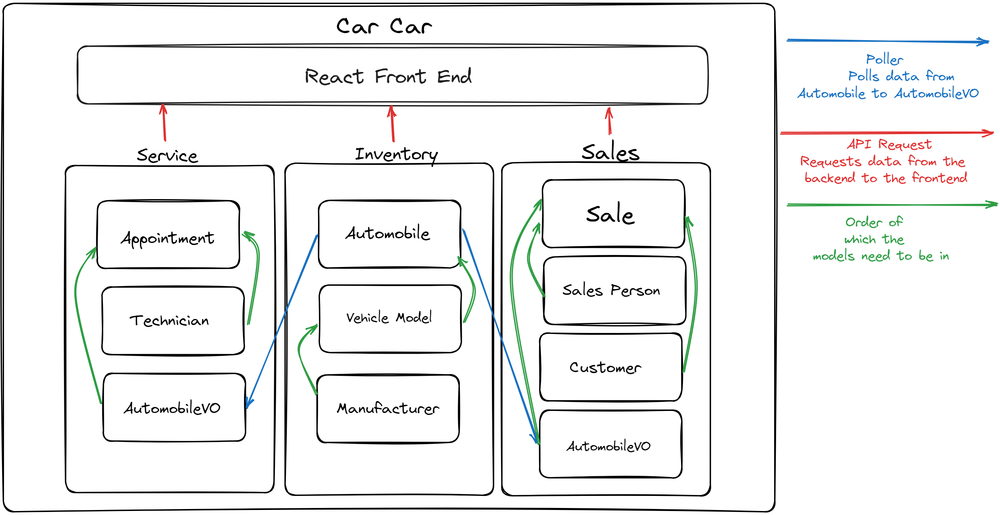

# CarCar

CarCar, an application for managing aspects of an automobile dealership—specifically its inventory, service center, and sales.

### Team:

##### * [Daniel Hernandez](https://gitlab.com/Rorschach3)- Sales microservice

##### * [Jorge Laderos De Santiago](https://gitlab.com/landerosjorge) - Service microservice

## Install and Run Locally

**Make sure you have Docker, Git, and Node.js 18.2 or above**

Fork the repository using this link
`https://gitlab.com/landerosjorge/project-beta`


Then clone the project

```bash
  git clone https://gitlab.com/landerosjorge/project-beta.git
```

3. Change directories into to the project directory

```bash
  cd project-beta
```

4. Create database using Docker command

```bash
  docker volume create beta-data
```

5. Build the Docker containers.
   Wait until this process is completely finished before running the next command.

```bash
 docker-compose build
```

6. Start up Docker containers

```bash
 docker-compose up
```

7. Open project using your favorite code editor VS Code

```bash
code .
```

## Design


## Homepage


#

# Inventory Microservice

Our Inventory Microservice creates data for both Sales and Service to use with its Automobile. It also keeps track of the manufacturer and model of the certain automobile. When that data gets sent to the other microservices with a poller, its stored as AutomobileVO(a reference to Automobile). We do so to keep on track of the current inventory of cars we have in our dealership.

## API References For Inventory

---

***Manufacturers***

| Action         | Request  | Endpoint               |
| :-----------     | :------- | :--------------------- |
| List Manufacturers |  `GET`   |  `http://localhost:8100/api/manufacturers/`   |
| Create Manufacturer |  `POST`   |  `http://localhost:8100/api/manufacturers/`   |
| Get Specific Manufacturer |  `GET`   |  `http://localhost:8100/api/manufacturers/:id/` |
| Update Specific Manufacturer |  `PUT` | `http://localhost:8100/api/manufacturers/:id/` |
| Delete Specific Manufacturer |  `DELETE`   |  `http://localhost:8100/api/manufacturers/:id/` |

**Body Requred to Create A Manufacturer**

```
{
  "name": "Honda"
}
```

**Return Response: Creating A Manufacturer**

```
{
  "href": "/api/manufacturers/1/",
  "id": 1,
  "name": "Honda"
}
```

**Return Response: List Manufacturers**

```
{
	"manufacturers": [
		{
			"href": "/api/manufacturers/1/",
			"id": 1,
			"name": "Honda"
		},
		{
			"href": "/api/manufacturers/2/",
			"id": 2,
			"name": "Nissan"
		},
		{
			"href": "/api/manufacturers/3/",
			"id": 3,
			"name": "Toyota"
		}
	]
}
```

---

***Vehicle Models***

| Action         | Request  | Endpoint               |
| :-----------  | :------- | :--------------------- |
| List Vehicle Models    |  `GET`   |  `http://localhost:8100/api/models/`   |
| Create Vehicle Model |  `POST`   |  `http://localhost:8100/api/models/`   |
| GET Specific Vehicle Model |  `GET`   |  `http://localhost:8100/api/models/:id/` |
| Update Specific Vehicle Model |  `PUT`   |  `http://localhost:8100/api/models/:id/` |
| Delete Specific Vehicle Model |  `DELETE`   |  `http://localhost:8100/api/models/:id/` |

**Body Requred to Create A Vehicle Model**

```
{
  "name": "S200",
  "picture_url": "https://upload.wikimedia.org/wikipedia/commons/thumb/d/dc/HondaS2000-004.jpg/1200px-HondaS2000-004.jpg",
  "manufacturer_id": 1
}
```

**Return Response: Creating A Vehicle Model**

```
{
	"href": "/api/models/1/",
	"id": 1,
	"name": "S200",
	"picture_url": "https://upload.wikimedia.org/wikipedia/commons/thumb/d/dc/HondaS2000-004.jpg/1200px-HondaS2000-004.jpg",
	"manufacturer": {
		"href": "/api/manufacturers/1/",
		"id": 1,
		"name": "Honda"
	}
}
```

**Return Response: List Vehicle Models**

```
{
	"models": [
		{
			"href": "/api/models/1/",
			"id": 1,
			"name": "S200",
			"picture_url": "https://upload.wikimedia.org/wikipedia/commons/thumb/d/dc/HondaS2000-004.jpg/1200px-HondaS2000-004.jpg",
			"manufacturer": {
				"href": "/api/manufacturers/1/",
				"id": 1,
				"name": "Honda"
			}
		},
		{
			"href": "/api/models/2/",
			"id": 2,
			"name": "R34",
			"picture_url": "https://cars.usnews.com/images/article/202203/129043/001-_Tokumeigakarinoaoshima_-_wc_-_Tuned_Nissan_SKYLINE_GT-R_GF-BNR34_front_Cropped.jpg",
			"manufacturer": {
				"href": "/api/manufacturers/2/",
				"id": 2,
				"name": "Nissan"
			}
		},
		{
			"href": "/api/models/3/",
			"id": 3,
			"name": "Supra",
			"picture_url": "https://cdn.motor1.com/images/mgl/PKZQL/s1/1997-toyota-supra-sold-for-176-000-at-auction.jpg",
			"manufacturer": {
				"href": "/api/manufacturers/3/",
				"id": 3,
				"name": "Toyota"
			}
		}
	]
}
```

---

***Automobiles***

| Action         | Request  | Endpoint               |
| :-----------     | :------- | :--------------------- |
| List Automobiles |  `GET`   |  `http://localhost:8100/api/automobiles/`   |
| Create Automobile |  `POST`   |  `http://localhost:8100/api/automobiles/`   |
| Get Specific Automobile     | `GET`   | `http://localhost:8100/api/automobiles/:vin/`|
| Update Specific Automobile |  `PUT`   |  `http://localhost:8100/api/automobiles/:vin/` |
| Delete Specific Automobile |  `DELETE` |  `http://localhost:8100/api/automobiles/:vin/` |

**Body Requred to Create A Automobile**

```
{
  "color": "White",
  "year": 2000,
  "vin": "JHMAP11432T2N3BH3",
  "model_id": 1
}
```

**Return Response: Creating A Automobile**

```
{
	"href": "/api/automobiles/JHMAP11432T2N3BH3/",
	"id": 1,
	"color": "White",
	"year": 2000,
	"vin": "JHMAP11432T2N3BH3",
	"model": {
		"href": "/api/models/1/",
		"id": 1,
		"name": "S200",
		"picture_url": "https://upload.wikimedia.org/wikipedia/commons/thumb/d/dc/HondaS2000-004.jpg/1200px-HondaS2000-004.jpg",
		"manufacturer": {
			"href": "/api/manufacturers/1/",
			"id": 1,
			"name": "Honda"
		}
	},
	"sold": false
}
```

**Return Response: List Automobiles**

```
{
	"autos": [
		{
			"href": "/api/automobiles/JHMAP11432T2N3BH3/",
			"id": 1,
			"color": "White",
			"year": 2000,
			"vin": "JHMAP11432T2N3BH3",
			"model": {
				"href": "/api/models/1/",
				"id": 1,
				"name": "S200",
				"picture_url": "https://upload.wikimedia.org/wikipedia/commons/thumb/d/dc/HondaS2000-004.jpg/1200px-HondaS2000-004.jpg",
				"manufacturer": {
					"href": "/api/manufacturers/1/",
					"id": 1,
					"name": "Honda"
				}
			},
			"sold": false
		},
		{
			"href": "/api/automobiles/FDJ9011432T2N3BH3/",
			"id": 2,
			"color": "White",
			"year": 1998,
			"vin": "FDJ9011432T2N3BH3",
			"model": {
				"href": "/api/models/2/",
				"id": 2,
				"name": "R34",
				"picture_url": "https://cars.usnews.com/images/article/202203/129043/001-_Tokumeigakarinoaoshima_-_wc_-_Tuned_Nissan_SKYLINE_GT-R_GF-BNR34_front_Cropped.jpg",
				"manufacturer": {
					"href": "/api/manufacturers/2/",
					"id": 2,
					"name": "Nissan"
				}
			},
			"sold": false
		},
		{
			"href": "/api/automobiles/FDJ9085032T2N3BH3/",
			"id": 3,
			"color": "Black",
			"year": 1997,
			"vin": "FDJ9085032T2N3BH3",
			"model": {
				"href": "/api/models/3/",
				"id": 3,
				"name": "Supra",
				"picture_url": "https://cdn.motor1.com/images/mgl/PKZQL/s1/1997-toyota-supra-sold-for-176-000-at-auction.jpg",
				"manufacturer": {
					"href": "/api/manufacturers/3/",
					"id": 3,
					"name": "Toyota"
				}
			},
			"sold": false
		}
	]
}
```

---

# Sales Microservice

### Automobile Services

***Technicians***

The Sales functionality needs to keep track of automobile sales that come from the inventory. A person cannot sell a car that is not listed in the inventory, nor can a person sell a car that has already been sold.

```http
Appointments
```

| Action         | Request  | Endpoint               |
| :-----------     | :------- | :--------------------- |
| List Appointments |  `GET`   |  `/api/appointments/`   |
| Create Appointments |  `POST`   |  `/api/appointments`   |
| Get Appointments |  `GET`   |  `/api/appointments/id/` |
|Set Appointment status to canceled|`PUT`|`/api/appointments/id/cancel`|
|Set Appointment status to finished|`PUT`|`/api/appointments/id/finish`|

#### Automobile Sales

```http
Salespeople
```

| Action       | Request  |Endpoint  |
| :--------   | :------- | :-------------------------------- |
| List salespeople | `GET` | `8090/api/salespeople/` |
| Create salespoeple| `POST` |`809api/salespeople/` |
| Delete salespeople| `DELETE` | `8090/api/salespeople/id/` |


```http
return Response:
"Firsname", "LastName", "Employee ID"
```

```http
Customers
```

| Action         | Request  | Endpoint               |
| :-----------     | :------- | :--------------------- |
| List customers |  `GET`   |  `8090/api/automobiles/`   |
| Create customer |  `POST`   |  `8090/api/automobiles`   |
| Delete customer |  `DELETE`   |  `8090/api/automobiles/id/` |


```http
Return Response:
"First Namne", "Last Name", "Phone Number", "Address"
```

```http
sales
```

| Action         | Request  | Endpoint               |
| :-----------     | :------- | :--------------------- |
| List sales |  `GET`   |  `8090/api/sales/`   |
| Record new sale |  `POST`   |  `8090/api/sales/`   |
| Delete sale |  `DELETE`   |  `8090/api/sales/id/` |


```http
Return Response:
Automobile VIN, Salersperson, Customer, Price
```
#

# Service Microservice

Kepps track of all service related things to the automobiles, it keeps track of current technicians inside our dealership and also all the service appointments wheter it being past or current. For each technician is assigned a employee id and id to keep track of which tecnician did what service. For each service we keep a record of when it was done, which technician was assigned, the reason, the current status, the vehicle vin, the customer name and their vip status. In order to keep track of VIP statuses we compare the vin inside out inventory with the service appointments data. The technician also has the option to finish and cancel an appointment.

## API References For Service

---

***Technicians***

| Action         | Request  | Endpoint               |
| :-----------     | :------- | :--------------------- |
| List technicians |  `GET`   |  `http://localhost:8080/api/technicians/`   |
| Create a technician |  `POST`   |  `http://localhost:8080/api/technicians/`   |
| Delete a specific technician |  `DELETE`   |  `http://localhost:8080/api/technicians/:id/`   |

**Body Requred to Create A Technician**

```
{
	"first_name": "Jorge",
	"last_name": "Landeros",
	"employee_id": "1"
}
```

**Return Response: Creating A Technician**

```
{
	"first_name": "Jorge",
	"last_name": "Landeros",
	"employee_id": "1",
	"id": 1
}
```

**Return Response: List Technicians**

```
{
	"technicians": [
		{
			"first_name": "Jorge",
			"last_name": "Landeros",
			"employee_id": "1",
			"id": 1
		},
		{
			"first_name": "John",
			"last_name": "Doe",
			"employee_id": "2",
			"id": 2
		},
		{
			"first_name": "Jane",
			"last_name": "Doe",
			"employee_id": "3",
			"id": 3
		}
	]
}
```

---

***Appointments***

| Action         | Request  | Endpoint               |
| :-----------     | :------- | :--------------------- |
| List Appointments |  `GET`   |  `http://localhost:8080/api/appointments/`   |
| Create an Appointment |  `POST`   |  `http://localhost:8080/api/appointments/`   |
| Delete aan Appointment |  `DELETE`   |  `http://localhost:8080/api/appointments/:id/`   |
| Finish Appointment |  `PUT`   |  `http://localhost:8080/api/appointments/:id/finish/`   |
| Cancel Appointment |  `PUT`   |  `http://localhost:8080/api/appointments/:id/cancel/`   |

**Body Requred to Create an Appointment**

```
{
	"date_time": "2026-06-06T23:29:43+00:00",
	"reason": "Windshield",
	"vin": "JHMAP11432T2N3BH3",
	"customer": "John Doe",
	"technician": "1"
}
```

**Return Response: Creating an Appointment**

```
{
	"id": 1,
	"is_vip": true,
	"date_time": "2026-06-06T23:29:43+00:00",
	"reason": "Windshield",
	"status": "current",
	"vin": "JHMAP11432T2N3BH3",
	"customer": "John Doe",
	"technician": {
		"first_name": "Jorge",
		"last_name": "Landeros",
		"employee_id": "1",
		"id": 1
	}
}
```

**Return Response: List Appointments**

```
{
	"appointments": [
		{
			"id": 1,
			"is_vip": true,
			"date_time": "2026-06-06T23:29:43+00:00",
			"reason": "Windshield",
			"status": "current",
			"vin": "JHMAP11432T2N3BH3",
			"customer": "John Doe",
			"technician": {
				"first_name": "Jorge",
				"last_name": "Landeros",
				"employee_id": "1",
				"id": 1
			}
		},
		{
			"id": 2,
			"is_vip": false,
			"date_time": "2026-03-02T22:12:55+00:00",
			"reason": "Engine Failures",
			"status": "current",
			"vin": "JHMAP11432T43RF34",
			"customer": "Alex Grace",
			"technician": {
				"first_name": "John",
				"last_name": "Doe",
				"employee_id": "2",
				"id": 2
			}
		},
		{
			"id": 3,
			"is_vip": true,
			"date_time": "2026-11-08T05:30:22+00:00",
			"reason": "Tire Rotation",
			"status": "current",
			"vin": "FDJ9085032T2N3BH3",
			"customer": "Tom Wood",
			"technician": {
				"first_name": "Jane",
				"last_name": "Doe",
				"employee_id": "3",
				"id": 3
			}
		}
	]
}
```

**Body Requred to Finish Appointment (id:1)**

```
{
	"status": "finished"
}
```

**Return Response: Finishing an Appointment**

```
{
	"id": 1,
	"is_vip": true,
	"date_time": "2026-06-06T23:29:43+00:00",
	"reason": "Windshield",
	"status": "finished",
	"vin": "JHMAP11432T2N3BH3",
	"customer": "John Doe",
	"technician": {
		"first_name": "Jorge",
		"last_name": "Landeros",
		"employee_id": "1",
		"id": 1
	}
}
```

**Body Requred to Cancel Appointment (id:2)**

```
{
	"status": "cancelled"
}
```

**Return Response: Canceling an Appointment**

```
{
	"id": 2,
	"is_vip": false,
	"date_time": "2026-03-02T22:12:55+00:00",
	"reason": "Engine Failures",
	"status": "cancelled",
	"vin": "JHMAP11432T43RF34",
	"customer": "Alex Grace",
	"technician": {
		"first_name": "John",
		"last_name": "Doe",
		"employee_id": "2",
		"id": 2
	}
}
```
